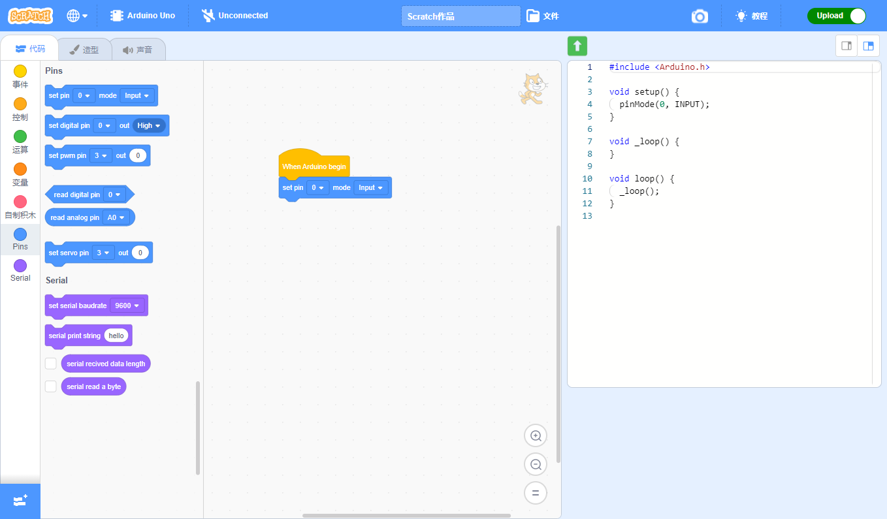

# 欢迎访问 ScratchHW Wiki

ScratchHW (Scratch Hardware) 起源于Scratch3。是一个专门为硬件设备定制的图形化编程软件，支持代码生成很编译下载功能，同时也支持实时模式，即Scratch3原本的EV3和Microbit的控制模式。

## 快速开始

- [我是普通用户](i-am-normal-user.md)
- [我是软件开发者](i-am-software-developer.md)

