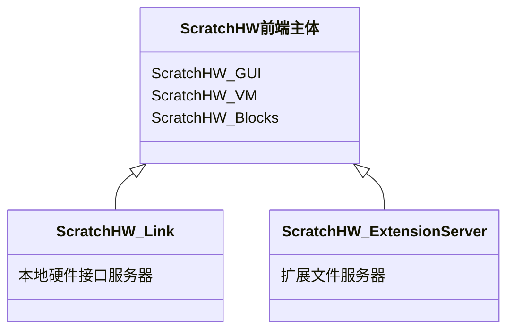

## 构架介绍

- [GUI](https://github.com/ScratchHW/scratchhw-gui) - 基于React的前端用户界面。
- [VM](https://github.com/ScratchHW/scratchhw-vm) - 管理状态和运行后台逻辑代码，接收GUI的操作请求并发送状态和事件给GUI。
- [Blocks](https://github.com/ScratchHW/scratchhw-blocks) - 从Google [Blockly](https://developers.google.com/blockly/) 项目创建的分支。这个仓库同时处理实现积木块（blocks）的UI显示、逻辑功能以及代码生成功能，它通过VM被GUI调用。
- [Link](https://github.com/ScratchHW/scratchhw-link) - 为前端程序提供本地硬件接口功能的服务器。
- [Extension Server](https://github.com/ScratchHW/scratchhw-extension-server) - 为前端程序提供本地保存的插件文件的服务器。

